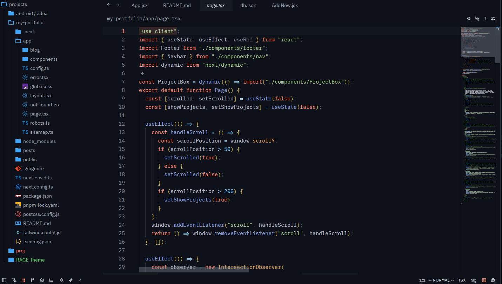

# RAGE Theme

A dark, high-contrast theme for [Zed](https://zed.dev) designed with bold syntax colors and a focused coding aesthetic.



---

## 📦 Installation

1. Open Zed
2. Go to **Settings → Themes**
3. Add the theme manually or place it in your themes directory:

```bash
~/.config/zed/themes/
